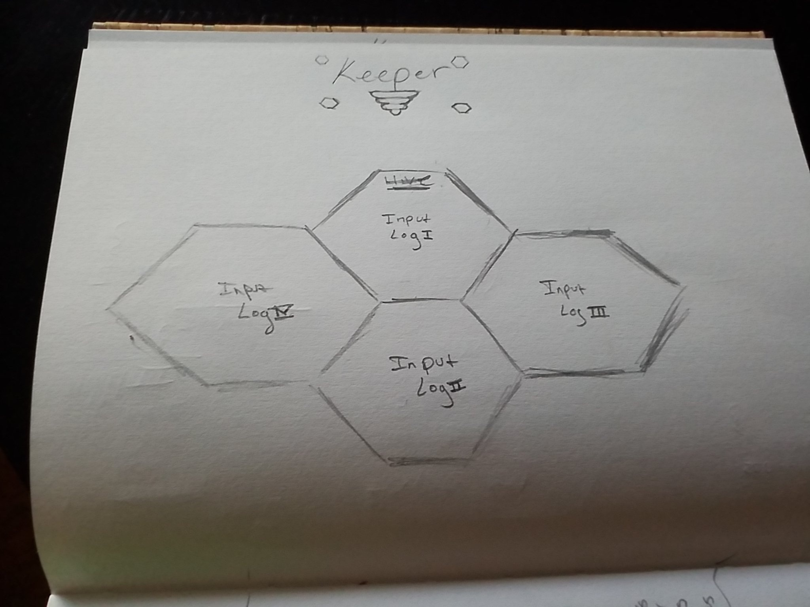
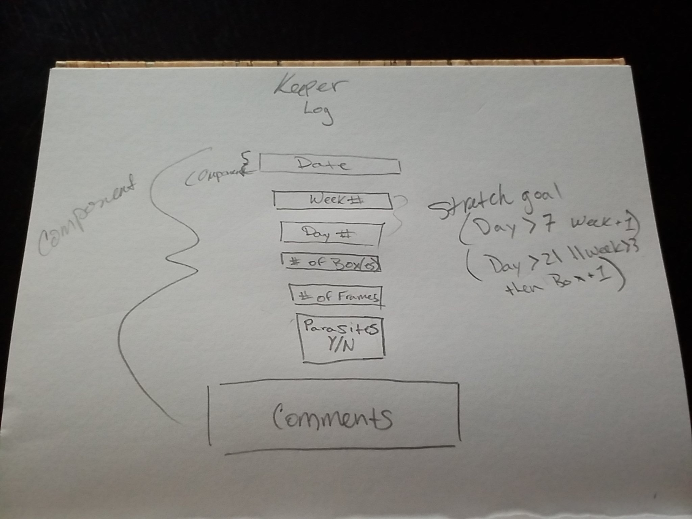
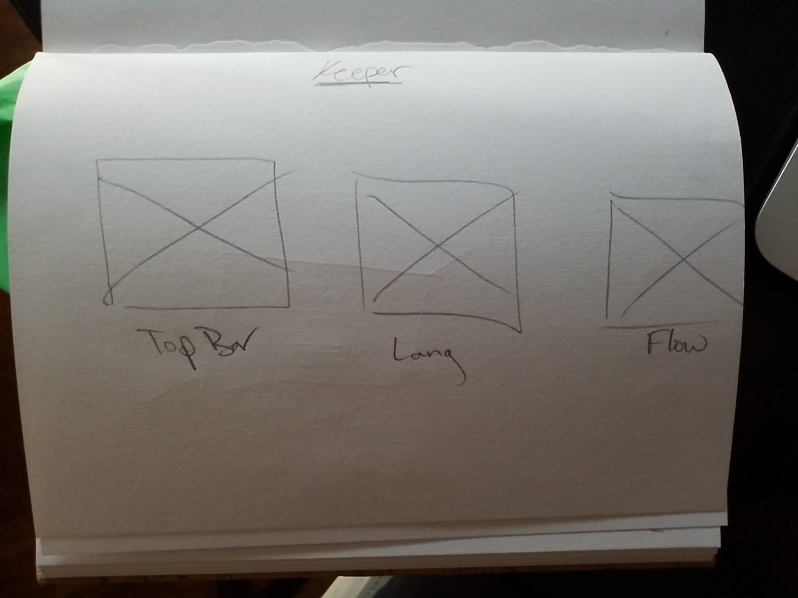
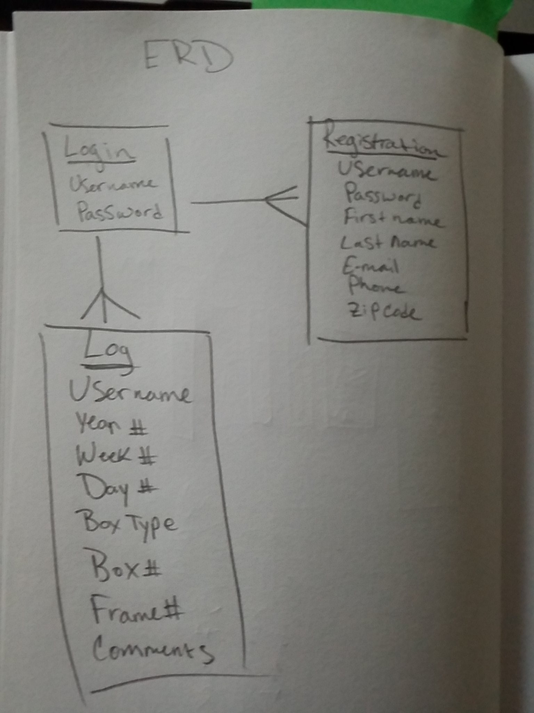

# Keeper

## Objectives

* Keeper's intented use is for data collection to track an apiary operation. The app is applicable to all individuals from beginner & novice beekeepers who are interested in keeping log entries as notes, enterprise implementation for commercial use, and even for research purposes to assist in identifying trends. The goal is to help beekeepers globally facilitate their colony populations and aid in the fight against the species decline as a whole. There are many contributing factors in the decline of the honey bee species and Keeper is aimed to end an epidemic at its core. 

## Project Board 
* [Project Board](https://github.com/gvona89/keeper/projects/1)
* [Heroku](https://aqueous-spire-04477.herokuapp.com/keeperlog)

## WireFrame

 
 
 
 

## ERD

## Technology Used

* React.js 
* MongoDb 
* Github 
* CSS
* HTML
* Heroku 
* Mongoose 
* Express

